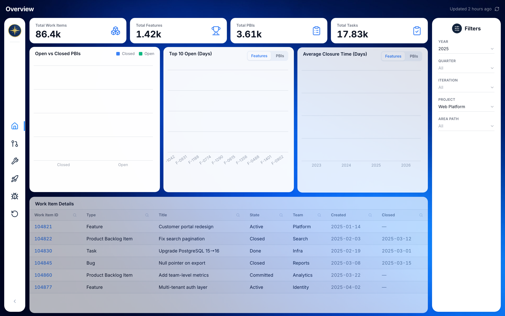
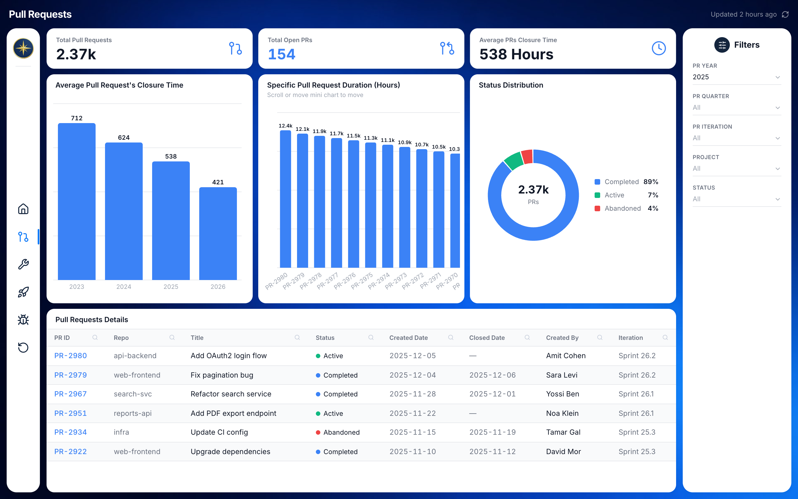
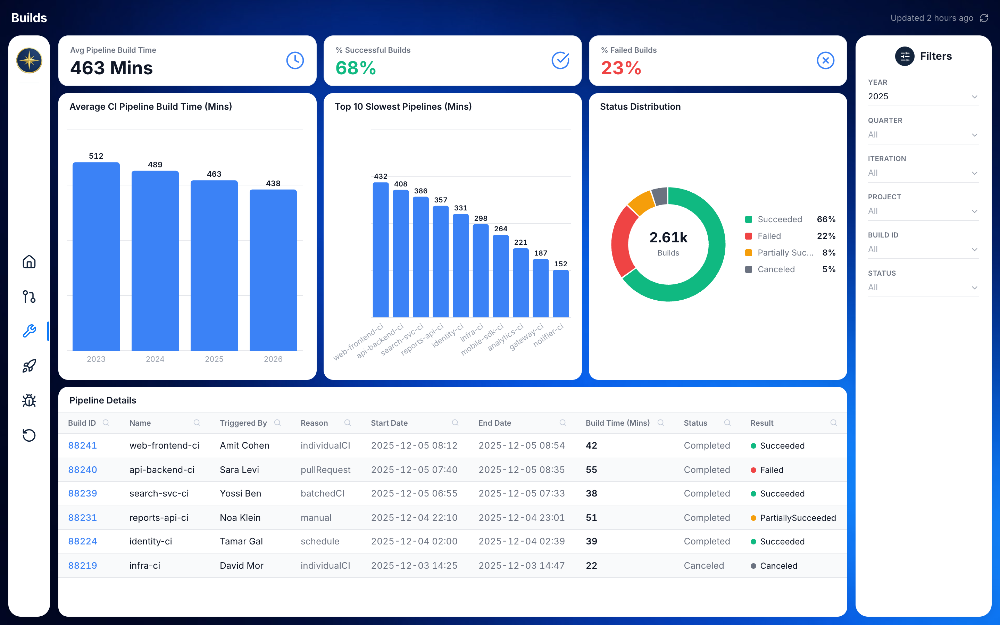
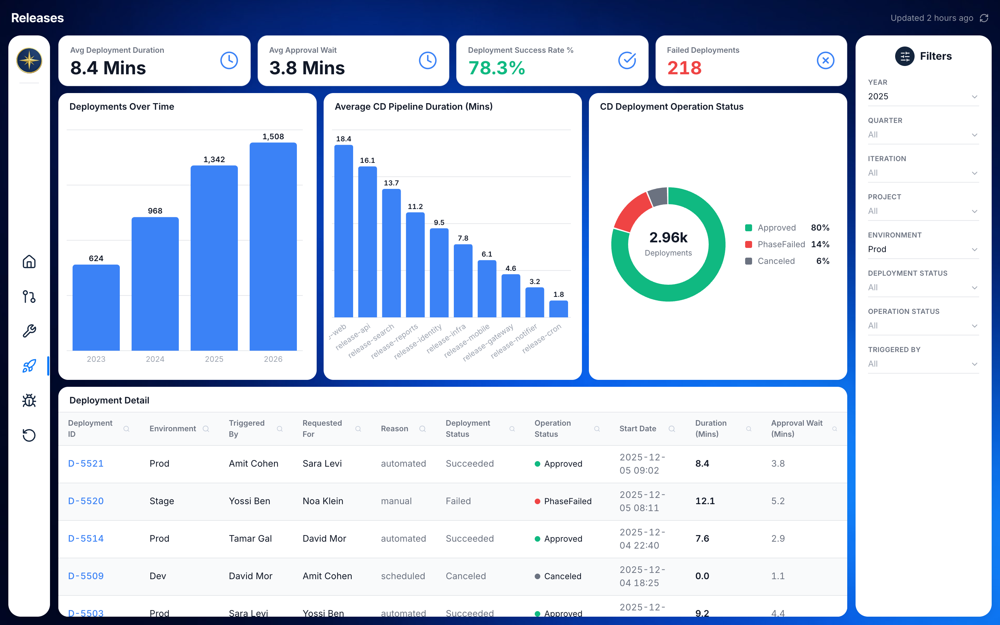
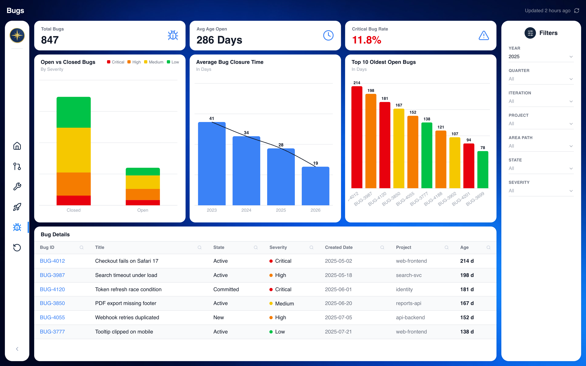
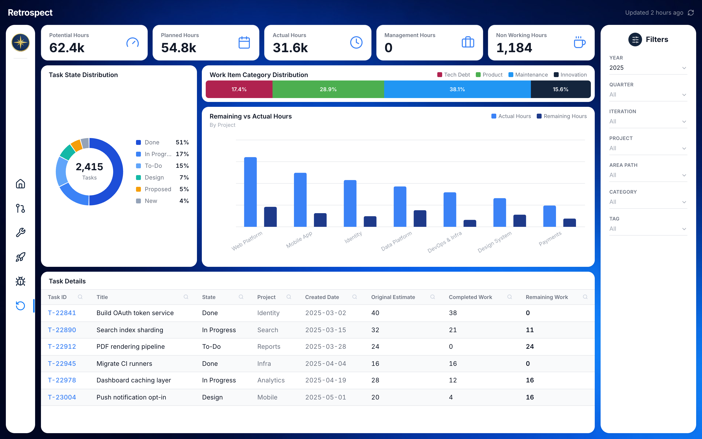

<h1 align="center">
  
  <br />
  <b>Compass</b>
</h1>

<p align="center">
  A portfolio-quality re-implementation of an internal Azure DevOps analytics dashboard — originally built in Qlik Sense, rebuilt as a modern React app.
</p>

<p align="center">
  
  
  
  
  
</p>

<p align="center">
  <a href="#about">About</a> &nbsp;|&nbsp;
  <a href="#screens">Screens</a> &nbsp;|&nbsp;
  <a href="#screenshots">Screenshots</a> &nbsp;|&nbsp;
  <a href="#tech-stack">Tech Stack</a> &nbsp;|&nbsp;
  <a href="#getting-started">Getting Started</a>
</p>

---

## About

Compass is a six-screen delivery lifecycle dashboard used across three management tiers. It tracks Azure DevOps data — pull requests, CI/CD pipeline runs, deployments, bugs, and sprint retrospectives — in a single, no-scroll interface.

The original dashboard runs in Qlik Sense against a nightly-refreshed PostgreSQL snapshot (Azure DevOps OData → Trino → Postgres → Qlik). This React re-implementation reproduces every screen's layout, KPIs, chart types, color system, and data model exactly, using realistic mock data at the same magnitudes.

---

## Screens

| # | Screen | Description |
|---|---|---|
| 1 | **Overview** | Work item counts by type (Features, PBIs, Tasks), open vs. closed PBIs, top-10 open items by age, average closure time |
| 2 | **Pull Requests** | PR volume, open count, average closure time, per-PR duration strip, status donut |
| 3 | **Builds** | CI pipeline build times, success/failure rates, slowest pipelines, status donut |
| 4 | **Releases** | CD deployment durations, approval wait times, success rate, operation status donut |
| 5 | **Bugs** | Bug counts, average open age, critical bug rate, severity-stacked bar, oldest open bugs |
| 6 | **Retrospect** | Capacity metrics, task state distribution, work item category breakdown, remaining vs. actual hours by project |

---

## Screenshots

| Overview | Pull Requests |
|---|---|
|  |  |

| Builds | Releases |
|---|---|
|  |  |

| Bugs | Retrospect |
|---|---|
|  |  |

---

## Tech Stack

| Layer | Technology |
|---|---|
| Framework | React 18 + TypeScript (strict) |
| Build tool | Vite 5 |
| Routing | React Router v6 |
| Charts | Recharts (Bar, Pie/Donut, ComposedChart) |
| Styling | Tailwind CSS v3 + CSS custom properties |
| Icons | lucide-react |
| Font | Inter (Google Fonts) |

---

## Getting Started

### Prerequisites

- Node.js 18+

### 1. Clone the repository

```bash
git clone https://github.com/Hezi777/Compass.git
cd Compass
```

### 2. Install dependencies

```bash
npm install
```

### 3. Start the dev server

```bash
npm run dev
```

Open [http://localhost:5173](http://localhost:5173) — the app redirects to `/overview` by default.

### 4. Build for production

```bash
npm run build
```

---

## License

MIT
